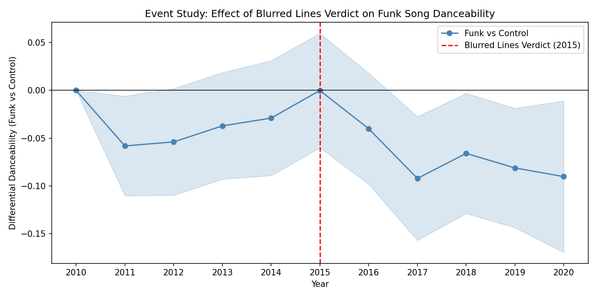

# Did the *Blurred Lines* Verdict Chill Funk Music?
### An Empirical Analysis of Copyright Law and Music Feature Trends (2010–2020)

## Background

In March 2015, a federal jury ruled that Robin Thicke and Pharrell Williams's *Blurred Lines* (2013) infringed the copyright of Marvin Gaye's *Got to Give It Up* (1977). The verdict was controversial because it extended copyright protection beyond specific notes and lyrics to broader stylistic elements — the "feel" of a song. Legal scholars warned this could create a **chilling effect**: artists avoiding funk and soul-influenced styles to reduce litigation risk.

This project tests that hypothesis empirically using Billboard Hot 100 chart data and Spotify audio features.

## Research Question

> Did Billboard Hot 100 songs with funk-like audio characteristics experience a relative decline in danceability after the 2015 *Blurred Lines* verdict, compared to non-funk songs?

## Data Sources

| Dataset | Source | Coverage |
|---|---|---|
| Billboard Hot 100 Year-End Charts | Scraped from billboard.com | 2010–2020 (1,098 songs) |
| Spotify Audio Features | Kaggle — Spotify Hit Predictor Dataset | 2010s decade |

The two datasets were merged on song title, yielding **1,016 matched songs** (92.5% coverage).

## Methodology

### Step 1: Scraping (``01_scrape_billboard.py``)
Scraped Billboard Hot 100 year-end charts for 2010–2020 using `requests` and `BeautifulSoup`.

### Step 2: Data Merging (``02_merge_data.py``)
Matched Billboard songs to Spotify audio features by song title. Removed duplicates and songs with missing features.

### Step 3: Clustering (``03_clustering.py``)
Used K-Means clustering (k=3) on five audio features — `danceability`, `energy`, `valence`, `acousticness`, `tempo` — fitted on pre-2015 data only (to avoid look-ahead bias). The cluster with highest danceability, valence, and energy was designated the **funk group** (n=508). The remaining songs served as the **control group** (n=508).

### Step 4: Difference-in-Differences + Event Study (``04_analysis.py``)
Estimated the following regression:

```
Danceability_it = β (is_funk_i × Post2015_t) + Year FE + ε
```

With heteroskedasticity-robust standard errors (HC3). Also estimated a fully interacted event study model to visualize pre- and post-verdict trends.

## Results

The DiD estimate is **−0.023** (p = 0.102), negative but not statistically significant at conventional levels. The event study plot shows a persistent downward trend in funk song danceability relative to the control group from 2015 onward, though confidence intervals are wide.



## Limitations

- **Parallel trends**: The pre-treatment period shows some divergence between funk and control groups, weakening the DiD assumption.
- **Proxy validity**: Spotify's `danceability` feature is an imperfect proxy for funk style. A more rigorous analysis would use music embeddings or genre-specific rhythm features.
- **Selection bias**: Billboard measures market outcomes (what got played), not creative output (what got made). The observed effect could reflect label decisions rather than artist behavior.

## Replication

```bash
pip install requests beautifulsoup4 pandas numpy scikit-learn statsmodels matplotlib
python 01_scrape_billboard.py
python 02_merge_data.py
python 03_clustering.py
python 04_analysis.py
```

Spotify audio features require the Kaggle dataset:
[Spotify Hit Predictor Dataset](https://www.kaggle.com/datasets/theoverman/the-spotify-hit-predictor-dataset)
